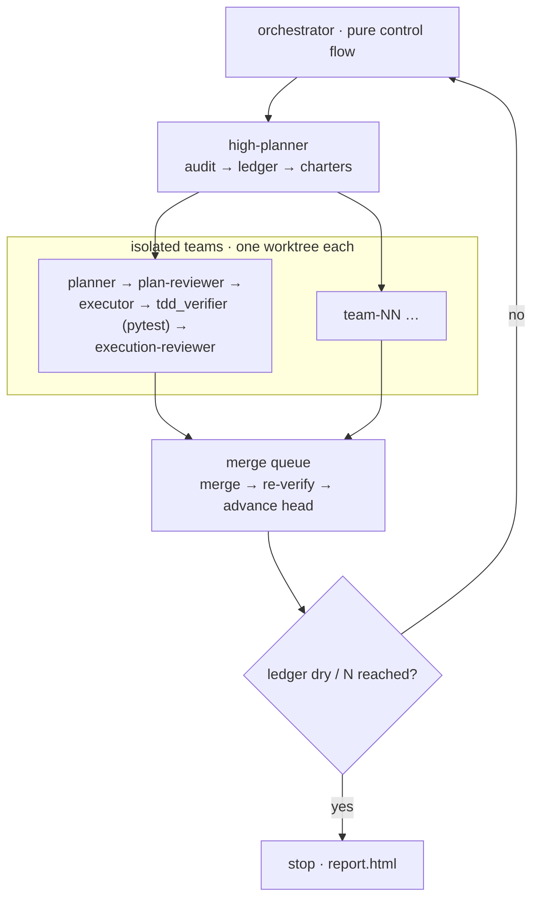

# Continuous Improvement Harness (CIH)

> A multi-agent system that **audits any codebase, finds high-value improvements, and ships them
> in TDD-gated iterations** — autonomously, and unable to push or bulk-stage by construction.

<p>
  <a href="https://pypi.org/project/cih-agent/"></a>
  <a href="https://github.com/ccomkhj/continuous-improvement-harness/actions/workflows/ci.yml"></a>
  
  
  
</p>

A change only merges if a **non-LLM verifier proves** — by checking out the commits and running
the tests itself — that a new test failed before the fix and passes after, with the full suite
still green. Every team works in a disposable git worktree; `git push` and `git add -A` are
blocked at the wrapper level. Runs as an interactive CLI (with a `--non-interactive` opt-out for CI/scripts) or as an interactive Claude Code skill.

## How it works



A **high-planner** scores improvement opportunities and splits them into independent charters
(meant to touch disjoint files). Each charter runs a five-stage pipeline — planner →
plan-reviewer → executor → mechanical pytest verifier → execution-reviewer — in its own disposable
worktree; teams run **sequentially** (the worktrees keep them isolated). Passing teams merge
**one at a time** through a queue that merges onto the integration base, re-runs the full suite,
then advances the integration head — so any cross-team conflict is caught there. An **opportunity
ledger** remembers what's been tried, cools down failures, and drives the run to convergence.

## Quick start

Requires Python 3.11+ and the [Claude Code CLI](https://docs.claude.com/en/docs/claude-code)
(`claude`) on your `PATH` — CIH drives it for the agent pipeline.

```bash
pip install cih-agent

# interactive by default — cih interviews you for scope, then runs autonomously
cih --target-repo /abs/path/to/target --state-dir /abs/path/to/state

# scripted / CI — skip the interview and drive everything from flags (requires --mode)
cih --non-interactive --mode fixed-N --iterations 3 \
  --target-repo /abs/path/to/target --state-dir /abs/path/to/state \
  --focus tests --focus performance
```

`pip install cih-agent` installs the `cih` console command (the import name stays `cih`);
`cih …` is equivalent to `python -m cih.runner …`.

`target-repo` and `state-dir` must be absolute, distinct, and non-nested. Add `--report` to write
a self-contained `report.html` after every iteration.

## Use it in another repo

**CLI (interactive by default).** No setup beyond the install. From anywhere, point
`--target-repo` at the repo you want to improve and keep `--state-dir` *outside* it. The CLI
runs a short scoping interview before proceeding; pass `--non-interactive` (alias `--yes`) to
skip the interview for non-TTY/CI use (requires `--mode`):

```bash
pip install cih-agent

# interactive — cih asks for scope, then runs autonomously
cih --target-repo /abs/path/to/your-repo \
    --state-dir   /abs/path/to/your-repo-cih-state   # outside the target repo

# non-interactive / CI — skip interview, drive entirely from flags
cih --non-interactive --mode fixed-N --iterations 3 \
  --target-repo /abs/path/to/your-repo \
  --state-dir   /abs/path/to/your-repo-cih-state
```

**Interactive (`/cih` skill).** The skill and its agents aren't auto-installed by pip (Claude
Code loads them from `.claude/`, not from site-packages). Install them once, then invoke `/cih`
inside a Claude Code session:

```bash
cih install-skill                       # installs into ~/.claude (available in every repo)
cih install-skill --dest /path/to/your-repo/.claude   # or scope to one repo
```

The skill runs a short scoping interview, writes a `run.json`, then hands the run off to a
fresh Superset workspace that executes it headless (`cih --from-run-json …`) — so the long
autonomous run lives in its own workspace, not the scoping session.

## Why it's safe to leave running

- **Improvements are proven, not asserted** — the TDD verifier independently confirms red→green
  with the full suite passing; it hard-blocks skip markers and flags weak assertions.
- **Can't push or bulk-stage** — `git push`, `git remote`, and `git add -A/--all/.` are
  structurally unreachable; forbidden paths (`secrets/`, `*.pem`, `*.key`) are rejected.
- **Never touches your tree** — all work happens in disposable worktrees; state lives outside the
  target repo and every git command is logged.
- **Watchable** — each iteration / audit / team / merge milestone is appended to
  `<state_dir>/progress.md` (`tail -F` it to follow a run live); set `CIH_NOTIFY_CMD` to a notifier
  command (e.g. one that calls `osascript`) to also get a desktop notification per milestone.

## Tests

```bash
python -m pytest -q
```

> Full config lives in `RunConfig` (`cih/config.py`); role prompts in `.claude/agents/`.
</content>
