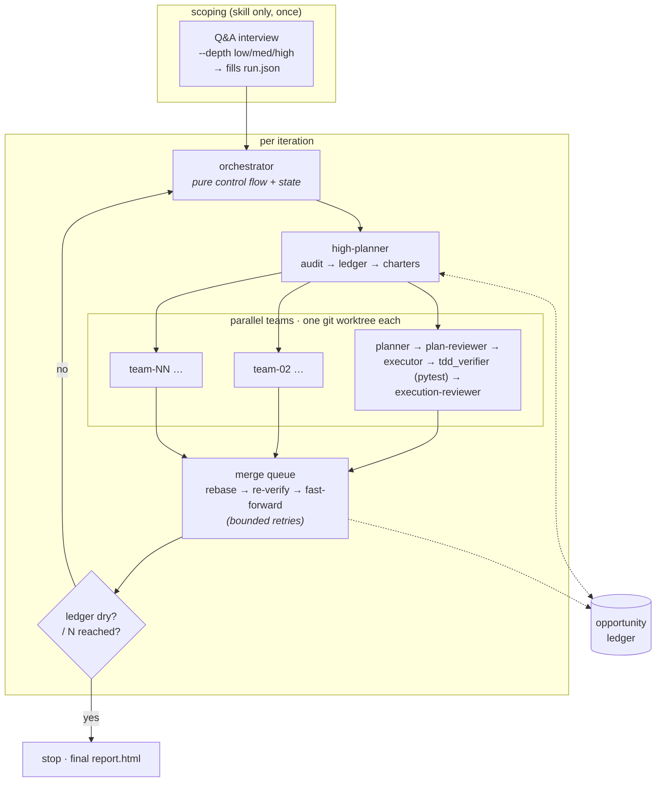

# Continuous Improvement Harness (CIH)

A hierarchical multi-agent harness that autonomously **audits a target codebase, finds
high-value improvements, and applies them in TDD-gated iterations** — runnable both as a
headless Python runner and as an interactive Claude Code skill, over one shared on-disk JSON
state format.

The target repo is always a **separate parameter** from the harness itself. CIH never pushes,
never stages files implicitly, and does all work in disposable per-team git worktrees.

## How it works

Each iteration, a **high-planner** audits the target and decomposes the work into
non-overlapping **team charters**. Every charter runs in its own isolated worktree through a
four-agent pipeline, gated by a mechanical pytest verifier and a skeptical reviewer. Passing
teams are integrated one at a time through a **bounded merge queue** that re-runs the full suite
before advancing the integration head. An **opportunity ledger** tracks what's been tried and
drives convergence.



**Termination** is either `fixed-N` (exactly N iterations) or `until-converged` (stop once the
ledger has no open opportunity above the value threshold for `convergence_dry_streak`
iterations). Both are hard-bounded by `--max-iterations` and a budget cap.

## Run (headless)

```bash
python -m cih.runner --mode fixed-N --iterations 3 \
  --target-repo /abs/path/to/target --state-dir /abs/path/to/state \
  --focus tests --focus performance
```

`until-converged` runs until the ledger is dry, bounded by `--max-iterations`:

```bash
python -m cih.runner --mode until-converged \
  --target-repo /abs/path/to/target --state-dir /abs/path/to/state \
  --max-iterations 25
```

## Run (interactive)

Invoke the `cih` skill in Claude Code (`.claude/skills/cih/SKILL.md`) with the target repo and
state dir. The skill renders the same agent contracts and orchestration steps, delegating to the
Agent/Task tools instead of `claude -p`.

Before the loop starts, the skill runs a short **Q&A scoping interview** to fill `run.json`. A
`--depth` flag caps how many questions it asks:

| `--depth` | question budget |
|-----------|-----------------|
| `low`     | up to 3         |
| `medium`  | up to 6 (default) |
| `high`    | up to 10        |

It asks one question at a time about *intent only* (`focus_areas`, `mode` + caps,
`value_threshold`), stops early once it understands the goal, shows a summary for a single
confirmation, then runs **fully autonomously** with no further interruptions. `--depth` itself
is never written to `run.json`.

## Visual report

Generate a self-contained HTML view of a run's state:

```bash
python -m cih.report --state-dir /abs/path/to/state   # writes <state_dir>/report.html
```

Or pass `--report` to the runner to (re)write `report.html` after every iteration; open it in a
browser — it auto-refreshes while the run is `in_progress` and stops once it's `done`/`failed`.
The page is fully self-contained (inline CSS, no network) and read-only over the state directory.

## Safety

- The harness **never pushes** and **never uses `git add -A`** — staging is explicit-only and
  the bypass is structurally unreachable, not merely discouraged.
- `target_repo` and `state_dir` are absolute, distinct, and non-nested; state lives **outside**
  the target repo, so agents can never stage harness artifacts.
- All work happens in disposable per-team worktrees; the target's working tree is never dirtied.
- Every git command is logged.

## Tests

```bash
python -m pytest -q
```

> Design specs and implementation plans live locally under `docs/superpowers/` (untracked).
