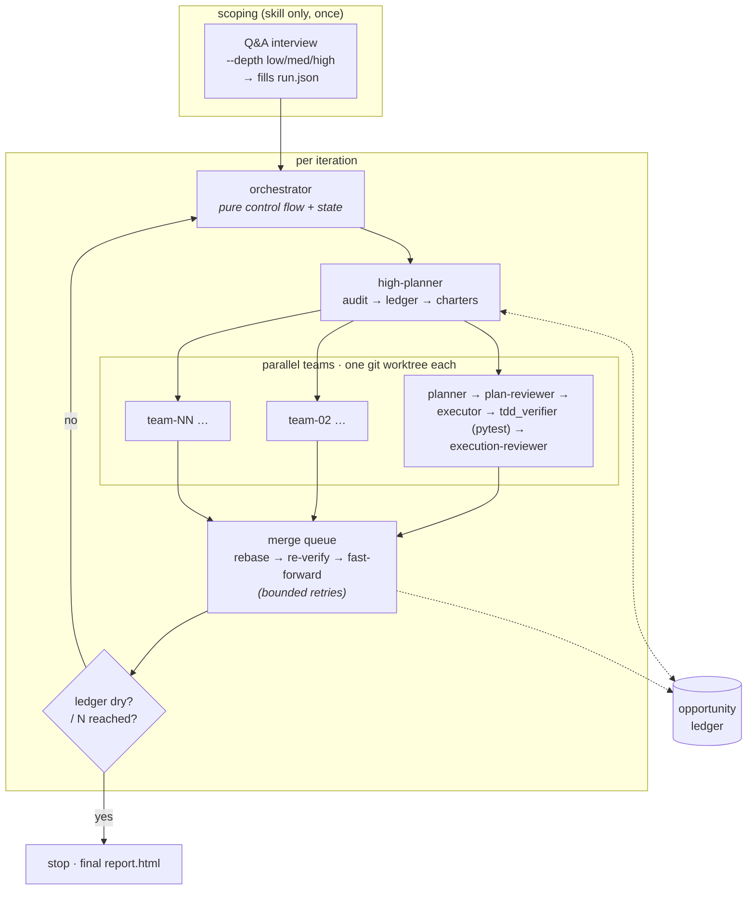

# Continuous Improvement Harness (CIH)

> A hierarchical multi-agent system that **audits any codebase, finds the highest-value
> improvements, and ships them in TDD-gated iterations** — fully autonomously, and without ever
> being able to push or stage a file it shouldn't.

<p>
  
  
  
  
</p>

CIH turns "an agent that edits your repo" into something you can actually trust to run unattended.
Every change it proposes has to survive a **mechanical red→green TDD proof** and a **skeptical
reviewer** before it's allowed anywhere near your integration branch — and the harness is
*structurally incapable* of pushing to a remote or running `git add -A`. The same engine runs two
ways: as a headless Python runner for CI/cron, or as an interactive Claude Code skill.

---

## Contents

- [Why CIH](#why-cih)
- [How it works](#how-it-works)
- [Quick start](#quick-start)
- [Architecture](#architecture)
  - [The team pipeline](#the-team-pipeline)
  - [The mechanical TDD verifier](#the-mechanical-tdd-verifier)
  - [The merge queue](#the-merge-queue)
  - [The opportunity ledger & convergence](#the-opportunity-ledger--convergence)
- [Safety guarantees](#safety-guarantees)
- [Visual report](#visual-report)
- [Configuration reference](#configuration-reference)
- [Tests](#tests)
- [Project layout](#project-layout)

---

## Why CIH

Most "autonomous coding agent" demos fall apart the moment you point them at a real repo and walk
away. They hallucinate green test runs, weaken assertions to make things pass, stage secrets, or
quietly push half-finished work. CIH is built around the assumption that **the agents will
sometimes be wrong**, and makes that safe:

- **Improvements are earned, not asserted.** A change only merges if a non-LLM verifier can
  *prove* — by checking out the commits and running the tests itself — that a new test failed
  before the fix and passes after it, with the full suite still green.
- **The target repo is a separate parameter from the harness.** CIH never works in-place: every
  team gets a disposable git worktree, and run state lives in a directory *outside* the target.
- **The dangerous operations are unreachable, not discouraged.** `git push`, `git remote`, and
  `git add -A/--all/.` are blocked at the wrapper level — there is no flag to turn them back on.
- **It knows when to stop.** An opportunity ledger tracks what's been tried, cools down repeated
  failures, and drives the run to convergence instead of churning forever.

If you want a star-worthy reference for *how to orchestrate LLM agents responsibly*, the
[Architecture](#architecture) section is the main event.

## How it works

Each iteration, a **high-planner** audits the target and decomposes the work into non-overlapping
**team charters**. Every charter runs in its own isolated worktree through a five-agent pipeline,
gated by a mechanical pytest verifier and a skeptical reviewer. Passing teams are integrated one
at a time through a **bounded merge queue** that re-runs the full suite before advancing the
integration head. An **opportunity ledger** tracks what's been tried and drives convergence.



**Termination** is either `fixed-N` (exactly N iterations) or `until-converged` (stop once the
ledger has no open opportunity above the value threshold for `convergence_dry_streak` iterations).
Both are hard-bounded by `--max-iterations` and an optional budget cap.

## Quick start

Requires **Python 3.11+**. The only runtime dependency is `jsonschema`; tests use `pytest`.

```bash
git clone https://github.com/ccomkhj/continuous-improvement-harness
cd continuous-improvement-harness
pip install -e ".[dev]"
```

### Run it headless

Point it at a target repo and a (separate) state directory. Both paths must be **absolute,
distinct, and non-nested**.

```bash
# exactly 3 iterations, focused on tests and performance
python -m cih.runner --mode fixed-N --iterations 3 \
  --target-repo /abs/path/to/target --state-dir /abs/path/to/state \
  --focus tests --focus performance
```

```bash
# run until the ledger is dry, bounded by --max-iterations
python -m cih.runner --mode until-converged \
  --target-repo /abs/path/to/target --state-dir /abs/path/to/state \
  --max-iterations 25
```

Add `--report` to (re)write a self-contained `report.html` after every iteration.

### Run it interactively

Invoke the `cih` skill in Claude Code (`.claude/skills/cih/SKILL.md`) with the target repo and
state dir. The skill renders the same agent contracts and orchestration steps, delegating to the
Agent/Task tools instead of `claude -p`.

Before the loop starts, the skill runs a short **Q&A scoping interview** to fill `run.json`. A
`--depth` flag caps how many questions it asks:

| `--depth` | question budget |
|-----------|-----------------|
| `low`     | up to 3         |
| `medium`  | up to 6 (default) |
| `high`    | up to 10        |

It asks one question at a time about *intent only* (`focus_areas`, `mode` + caps,
`value_threshold`), stops early once it understands the goal, shows a summary for a single
confirmation, then runs **fully autonomously** with no further interruptions. `--depth` itself is
never written to `run.json`.

## Architecture

CIH is deliberately layered so the **control flow is dumb and the gates are smart**. The
orchestrator is pure state + flow control; all judgment lives in agents, and all *proof* lives in
non-LLM verifiers.

### The team pipeline

Each charter is handed to a fresh worktree and run through five role agents (defined as prompt
contracts in `.claude/agents/`, schema-validated on every call):

| Role | Responsibility | Gate it must clear |
|------|----------------|--------------------|
| **high-planner** | Audits the target, emits scored opportunities + non-overlapping charters | Output validated against the opportunity/charter schema |
| **planner** | Turns one charter into an ordered, testable task list | Must be approved by the plan-reviewer (bounded retries) |
| **plan-reviewer** | Skeptically reviews the plan for scope, testability, conflict risk | — |
| **executor** | Implements the plan as strict red→green TDD commits | Must clear the mechanical TDD verifier **and** the execution-reviewer |
| **execution-reviewer** | Judges the executed work on top of a green mechanical verdict | Final human-style sign-off before the team is eligible to merge |

A team only reports `passed` when the plan was approved, every commit cleared the verifier, and the
execution-reviewer signed off — otherwise it's rejected with a reason and recorded in the ledger.

### The mechanical TDD verifier

This is the part that makes "the agent says the tests pass" irrelevant — the verifier checks out
the commits and runs the tests *itself*. For each red→green commit pair it independently proves:

- The working tree is **clean** before it starts (otherwise it refuses, leaving HEAD untouched).
- **`green` descends from `red`**, and `red` has exactly **one parent** (no root/merge commits).
- The `red` commit touches **only test paths**; the `green` commit touches **no test paths** — so
  the fix can't smuggle in test edits, and the test can't smuggle in implementation.
- The **baseline** (red's parent) is clean and green (exit 0, or 5 = "no tests").
- The `red` commit's test command **fails with a genuine test failure** (exit 1) — a
  collection/usage error doesn't count as a real failing test.
- The `green` commit's test command **passes**, *and* the **full suite** passes.
- Obvious assertion-weakening (`@pytest.mark.skip`, `pytest.skip(...)`) is **hard-blocked**; subtle
  smells like `assert True` are flagged as `suspicious` and routed to the execution-reviewer rather
  than silently allowed.

HEAD is always restored afterward, even on error. The verifier is pluggable via a `tdd_adapter`;
`pytest` is the built-in mechanical adapter, and unknown adapters degrade to a clearly-labelled
reviewer-only fallback instead of pretending to prove something.

### The merge queue

Passing teams are **never** merged in parallel. The merge queue integrates them one at a time:
rebase the team's branch onto the current integration head, **re-run the full suite**, and only
fast-forward if it's still green. Conflicts and regressions trigger bounded retries; teams that
can't be cleanly integrated are rejected and fed back to the ledger. This keeps the integration
head green at every step, regardless of how many teams ran concurrently.

### The opportunity ledger & convergence

The ledger is the harness's memory. The high-planner's audit upserts scored **opportunities**
(value, confidence, effort, risk, rationale), fingerprinted so the same idea isn't re-litigated
across iterations. As teams merge or fail, the ledger records the outcome:

- Merged opportunities are marked done.
- Repeated failures accrue attempts and enter a **cooldown** (`cooldown_iterations`), and are
  abandoned after `opportunity_max_attempts`.
- A run is **dry** when no open opportunity sits above `value_threshold`. In `until-converged`
  mode, `convergence_dry_streak` consecutive dry iterations stop the run.

Everything is persisted as on-disk JSON under the state directory, so a crashed run can be
reconciled against git ground truth (`orchestrator.reconcile`) and resumed.

## Safety guarantees

These are invariants enforced in code (`cih/safety.py`), not conventions:

- **Never pushes.** `git push` and `git remote` are blocked by the git wrapper — the no-push
  invariant is structurally unreachable, not merely discouraged.
- **Never bulk-stages.** `git add -A`, `--all`, `-a`, and `git add .` are blocked; staging goes
  through an explicit-paths-only wrapper.
- **Refuses forbidden paths.** Patterns like `secrets/`, `*.pem`, `*.key`, and `.cih/` are
  rejected, along with any absolute path or `..` traversal attempt.
- **State lives outside the target.** `target_repo` and `state_dir` are validated to be absolute,
  distinct, and non-nested — agents can never stage harness artifacts into the target.
- **Clean-tree preflight.** The harness refuses to start against a dirty target working tree.
- **Disposable worktrees.** All work happens in per-team git worktrees; the target's working tree
  is never dirtied, and a crashed run keeps its worktrees for post-mortem.
- **Auditable.** Every git command is appended to a progress log.

## Visual report

Generate a self-contained HTML view of a run's state:

```bash
python -m cih.report --state-dir /abs/path/to/state   # writes <state_dir>/report.html
```

Or pass `--report` to the runner to (re)write `report.html` after every iteration; open it in a
browser — it auto-refreshes while the run is `in_progress` and stops once it's `done`/`failed`.
The page is fully self-contained (inline CSS, no network) and read-only over the state directory.

## Configuration reference

The CLI exposes the common knobs; the full set lives in `RunConfig` (`cih/config.py`) and can be
set via `run.json` or the interactive scoping phase.

| Option | CLI flag | Default | Meaning |
|--------|----------|---------|---------|
| `mode` | `--mode` | *(required)* | `fixed-N` or `until-converged` |
| `iterations` | `--iterations` | — | exact count for `fixed-N` |
| `target_repo` | `--target-repo` | *(required)* | absolute path to the repo being improved |
| `state_dir` | `--state-dir` | *(required)* | absolute path for run state (outside the target) |
| `focus_areas` | `--focus` (repeatable) | `[]` | areas to audit/improve |
| `max_iterations` | `--max-iterations` | `25` | hard ceiling on iterations |
| `budget_cap` | — | `None` | max teams across the whole run |
| `value_threshold` | — | `0.5` | minimum opportunity value to act on |
| `convergence_dry_streak` | — | `2` | dry iterations needed to converge |
| `max_teams_per_iteration` | — | `4` | parallel teams per iteration |
| `plan_review_retries` | — | `2` | plan→review retries per team |
| `exec_review_retries` | — | `2` | execute→review retries per team |
| `per_team_attempt_cap` | — | `4` | total attempts cap per team |
| `integration_retries` | — | `2` | merge-queue retries per team |
| `cooldown_iterations` | — | `2` | cooldown after a failed opportunity |
| `opportunity_max_attempts` | — | `3` | attempts before abandoning an opportunity |
| `tdd_adapter` | — | `pytest` | mechanical TDD verifier backend |

## Tests

```bash
python -m pytest -q
```

The suite covers the orchestrator, integration/merge queue, the TDD verifier's invariants, the
safety wrappers, the ledger, resume/reconciliation, the HTML report, and conformance between the
headless runner and the interactive skill.

## Project layout

```
cih/                 # the harness engine
  orchestrator.py    #   pure control flow + state, convergence, reconcile
  team.py            #   the five-agent per-charter pipeline
  tdd_verifier.py    #   mechanical red→green pytest proof
  merge_queue.py     #   one-at-a-time rebase + re-verify integration
  integration.py     #   wires worktrees, teams, and the merge queue together
  ledger.py          #   opportunity tracking, cooldown, convergence
  safety.py          #   no-push / no-bulk-stage / forbidden-path enforcement
  config.py          #   RunConfig + validation
  report.py          #   self-contained HTML report
  runner.py          #   headless CLI entry point
.claude/agents/      # role-agent prompt contracts
.claude/skills/cih/  # interactive Claude Code skill
tests/               # pytest suite
```

> Design specs and implementation plans live locally under `docs/superpowers/` (untracked).
</content>
</invoke>
